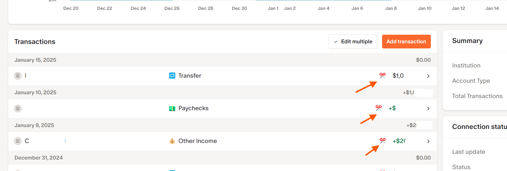
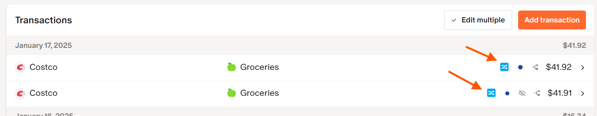
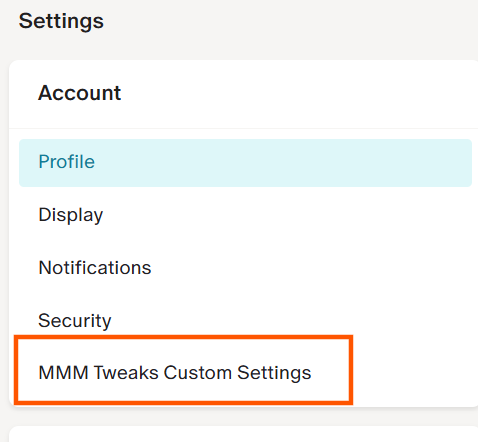
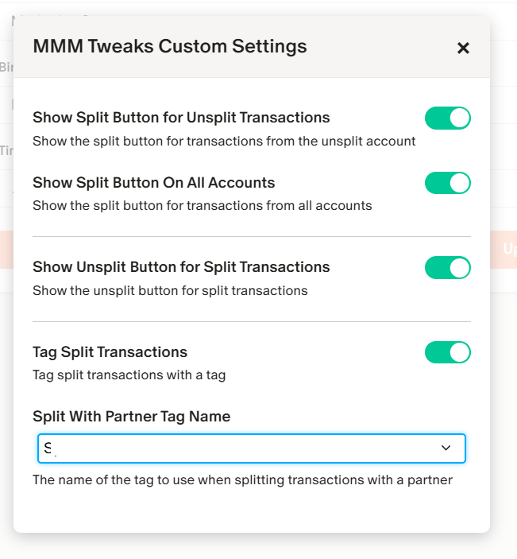

# Maddy's Monarch Money Extensions

Maddy's Monarch Money Extensions is a collection of customizations for the Monarch Money app that I have found useful. This is my first attempt at creating a Tampermonkey script and I had a lot of fun working on it. 

Hope you enjoy using it!

## v1.0 Feature List

*  Split transactions 50/50 with a single click from the transaction details screen.

* Configure which account's transactions the split button should appear on.
* Automatically add a tag of your choice to split transactions.

* Unsplit transactions with a single click from the transaction details screen.

## Installation

1. You will need to install the Tampermonkey extension for your browser to use these extensions. Install the Tampermonkey extension from the [Tampermonkey](https://www.tampermonkey.net/) website.
2. [Enable Developer](https://www.tampermonkey.net/faq.php?locale=en#Q209) mode for this extension to work with user scripts.
3. Now [click here](https://github.com/madushag/mmm-extensions/raw/refs/heads/main/mmm-exts.user.js) to install the latest version of the MMM Extensions script.
4. Once installed, refresh your browser on the Monarch Money website, navigate to the Settings page and configure the settings to your liking.

---

## Future Roadmap:

* Be able to configure the split share for each transaction.
* Be able to post split transactions to payment sharing apps like Splitwise.
* Eliminate dependency on Tampermonkey and publish as native browser extension.
* Other feature requests from the community.
